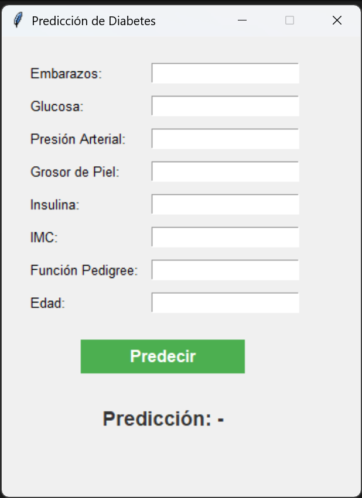
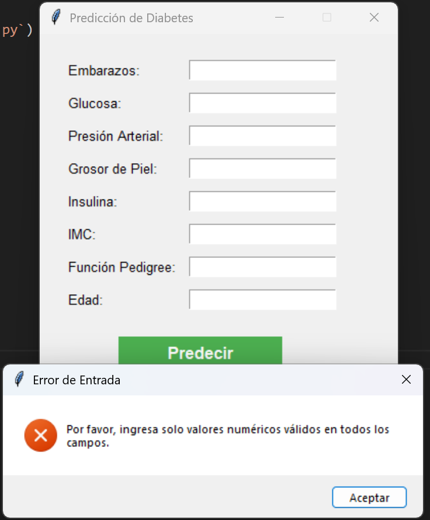
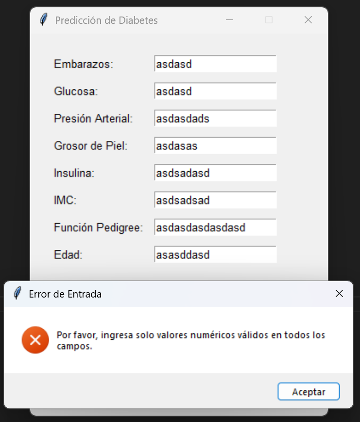

# Predicción de Diabetes con Machine Learning 🩺

Este proyecto es una aplicación de escritorio desarrollada en Python que utiliza un modelo de Machine Learning para predecir la probabilidad de que una persona tenga diabetes, basándose en 8 indicadores de salud. La interfaz gráfica fue creada con Tkinter para facilitar la interacción del usuario.

---

## ✨ Características Principales

* **Interfaz Gráfica Intuitiva:** Permite ingresar los datos de salud de forma sencilla.
* **Predicción Instantánea:** Utiliza un modelo de Regresión Logística entrenado para calcular la predicción en tiempo real.
* **Resultados Claros:** Muestra la predicción (Sí/No) junto con el porcentaje de probabilidad.
* **Arquitectura Modular:** El código está separado en lógica de predicción (`predictor.py`), interfaz de usuario (`gui.py`) y el punto de entrada (`main.py`).

---

## 📸 Capturas de Pantalla

A continuación se muestran algunas capturas de la aplicación en funcionamiento.

### Interfaz Principal
Aquí el usuario puede ingresar los valores para cada una de las variables médicas.

### Resultado de la Predicción
Una vez que se ingresan los datos y se hace clic en "Predecir", la aplicación muestra el resultado en la parte inferior.

### Manejo de Errores ⚠️
La aplicación también valida las entradas del usuario para prevenir errores.

**Error por campos vacíos:** Si el usuario no completa todos los campos, se muestra una advertencia.

**Error por datos no numéricos:** Si se ingresa texto en lugar de números, la aplicación notifica al usuario.

---

## 🛠️ Tecnologías Utilizadas

* **Python 3**
* **Tkinter:** para la interfaz gráfica.
* **Scikit-learn:** para entrenar y evaluar el modelo de Machine Learning.
* **Pandas:** para la manipulación de datos.
* **Joblib:** para exportar e importar el modelo entrenado.
* **Google Colab:** para el análisis exploratorio y el entrenamiento del modelo.